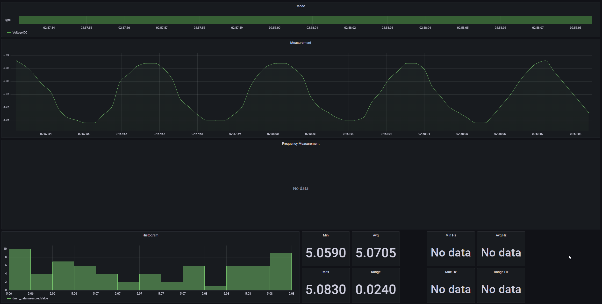

ESP8266 DMM Datalogger
---
All started with my attempt to eeprom-modify an Aneng Q10 to enable the RS232/UART interface. While the DTM0660L chip used in that multimeter supports that, the manufacturer of the multimeter repurposed the UART TX pin for the front button matrix.  

Hence my next attempt: Sniffing the communication between the DMM IC and the LCD IC. Used a cheap 8ch logic analyzer clone and pondered over the displayed information for a day. Turns out, the DTM0660L sends 137 bits to that unmarked IC, each bit standing for the state of a certain segment on the LCD.  

This little project sniffs that SPI traffic to reconstruct what the multimeter is currently displaying and sends that information via wifi to a server running influxdb.

Currently supports Voltage DC/AC, Current DC/AC, Resistance, Temperature and frequency when in one of the AC modes.

### Quick information
* Uses Zhongyi ZTY multimeter, Aneng Q10 is just a rebranded version of it
* Copy `secrets.h.example` to `secrets.h` and fill with your own information
* Pin D5,D6,D7 are hooked up to clock, data and enable/cs
* GND of the ESP8266 hooked up to BAT-
* 3V3 of the ESP8266 hooked up to VDD testpad
* Case just barely fits a WeMos D1 Mini (wrapped in kapton tape)
* Miraculously, NCV doesn't freak out. But it's still pretty garbage.

### Todo?
* Add in support for capacitance
* Generally clean up the project
* Add in some exception handling?

### Inspiration
[Decoding SPI packets](http://www.kerrywong.com/2017/11/13/reverse-engineering-of-bk-precision-1696-switching-power-supplys-lcd-protocol/)  
[Enabling RS232/UART on DTM0660L based multimeters](http://www.kerrywong.com/2016/03/19/hacking-dtm0660l-based-multimeters/), unfortunately doesn't work for the Q10  

